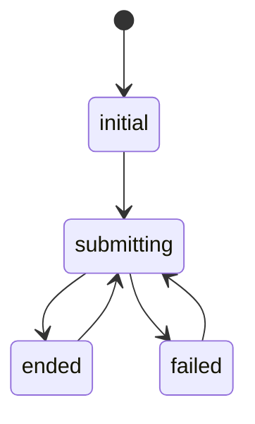

This enum defines the possible states of the
[form state machine](../classes/formstate.md) submit sequence.

## Enumeration members

### ended

•  **ended**:  = "ENDED"

The form has been submitted and the immediate submit has succeeded.

___

### failed

•  **failed**:  = "FAILED"

The form has been submitted and the immediate submit has failed.

___

### initial

•  **initial**:  = "INITIAL"

The form instance has not yet been submitted.

___

### started

•  **started**:  = "STARTED"

The form has been submitted and is submit resolution is pending.
